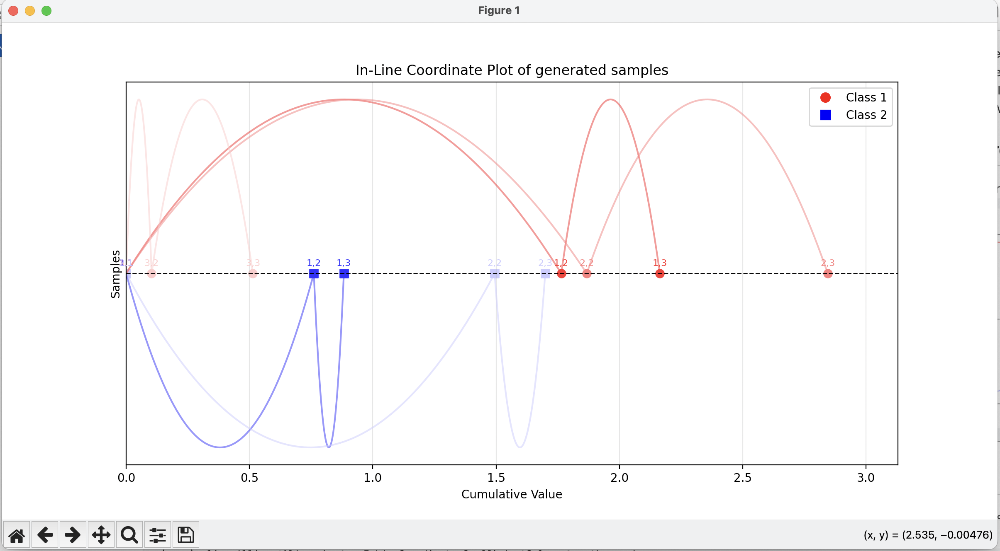

# InLineCoordinatesCoefficientSolver

In-Line Coordinates Coefficient Solver workspace while implementing novel coefficient analysis technique.

## Demonstrative Screenshot

First plotting version of the In-Line Coordinates Coefficient Solver.

## TASK for the CoefSwap "Coefficient Swapping" project

We are interested in the following tasks:

0. Plot the data, find issue where need to fix final swap order of two cases.
1. Fix one case coefficient.
2. Solve for the next case coefficient.
3. Replot the data, check if cases endpoint is swapped correctly.

We have the scenario where we have a set of data points, and we want to find the coefficients for a linear combination that swaps two conflicted cases of either class in the data.
